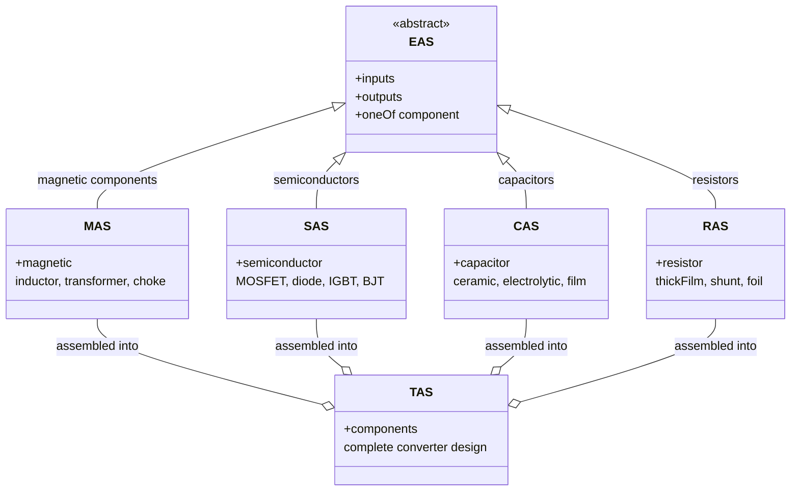
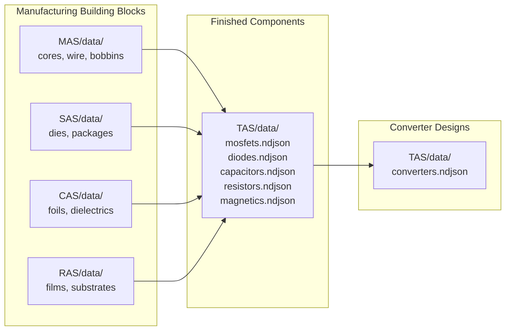

<h1 align="center">EAS - Electronic Agnostic Structure</h1>

<p align="center">
  <em>The abstract base for all electronic component schemas in the OpenConverters ecosystem</em>
</p>

<p align="center">
  <a href="https://opensource.org/licenses/MIT"></a>
  <a href="https://json-schema.org/"></a>
</p>

---

## What is EAS?

**EAS is the abstract base type (virtual class) for all electronic components** in the OpenConverters ecosystem. It defines the universal contract that every component -- whether a magnetic, semiconductor, capacitor, or resistor -- must satisfy: an `inputs` section, an `outputs` section, and exactly one component-type-specific payload.

EAS itself is never instantiated directly. Instead, it acts as a polymorphic container: any valid MAS, SAS, CAS, or RAS document is automatically a valid EAS document. This allows higher-level schemas like TAS (Topology Agnostic Structure) to reference "any component" without knowing its specific type.

### The Role of EAS



### Why EAS Exists

Without EAS, the TAS schema would need separate fields for each component type (`magnetic`, `semiconductor`, `capacitor`, `resistor`) and would break every time a new component type is added. Instead, TAS references EAS documents, and the `oneOf` discriminator in EAS determines the actual type at validation time.

This is the same pattern as a virtual base class in object-oriented programming: EAS defines the interface, and MAS/SAS/CAS/RAS provide the concrete implementations.

---

## The oneOf Discriminator

EAS uses JSON Schema's `oneOf` keyword to enforce that exactly one component type is present. The discriminator is the presence of a type-specific property key:

| Property Key | Schema | Component Type |
|-------------|--------|----------------|
| `magnetic` | MAS (`http://openmagnetics.com/schemas/magnetic.json`) | Inductors, transformers, chokes |
| `semiconductor` | SAS (`./semiconductor.json`) | MOSFETs, diodes, IGBTs, BJTs |
| `capacitor` | CAS (`./capacitor.json`) | Ceramic, electrolytic, film capacitors |
| `resistor` | RAS (`./resistor.json`) | Thin film, thick film, shunt, wirewound resistors |

A valid EAS document must contain `inputs`, `outputs`, and **exactly one** of the four component keys above.

### Example: A Resistor as an EAS Document

```json
{
    "inputs": {},
    "resistor": {
        "manufacturerInfo": {
            "datasheetInfo": {
                "part": {
                    "partNumber": "CRCW060310K0FKEA",
                    "technology": "thickFilm",
                    "case": "0603"
                },
                "electrical": {
                    "resistance": {"nominal": 10000},
                    "tolerance": 0.01,
                    "powerRating": 0.1
                },
                "mechanical": {
                    "shape": {"assembly": "SMT", "shapeType": "SMD Chip"}
                }
            }
        }
    },
    "outputs": []
}
```

This document is simultaneously a valid RAS document and a valid EAS document.

---

## How TAS References EAS Documents

TAS (Topology Agnostic Structure) describes complete power converter designs. Its `components.componentList` contains entries where each component's `data` field is an EAS document -- either inline or by reference:

### Inline (full EAS document embedded)

```json
{
    "name": "R1",
    "role": "currentSenseResistor",
    "data": {
        "inputs": {},
        "resistor": { "..." },
        "outputs": []
    }
}
```

### By Reference (path or URI to an external file)

```json
{
    "name": "R1",
    "role": "currentSenseResistor",
    "data": "components/R1_shunt.json"
}
```

This follows the same pattern used in MAS for core shapes and materials: data can be specified directly or by reference to a standard definition.

### Component Roles in TAS

TAS defines typed roles for each component category:

| Category | Roles |
|----------|-------|
| Magnetics | `mainInductor`, `resonantInductor`, `pfcInductor`, `filterInductor`, `mainTransformer`, `gateTransformer`, `currentTransformer` |
| Semiconductors | `highSideSwitch`, `lowSideSwitch`, `primarySwitch`, `secondarySwitch`, `clampSwitch`, `synchronousRectifier`, `pfcSwitch`, `outputRectifier`, `freewheelDiode`, `clampDiode`, `boostDiode` |
| Capacitors | `inputCapacitor`, `outputCapacitor`, `bulkCapacitor`, `resonantCapacitor`, `bootstrapCapacitor`, `decouplingCapacitor`, `snubberCapacitor`, `clampCapacitor` |
| Resistors | `currentSenseResistor`, `gateResistor`, `feedbackResistor`, `bleederResistor`, `snubberResistor`, `clampResistor` |

---

## Relationship to OpenMagnetics/MAS

MAS (Magnetic Agnostic Structure) was the first component schema, developed under the [OpenMagnetics](https://github.com/OpenMagnetics) organization. It defines the data format for inductors, transformers, and chokes, and is backed by computation libraries (PyOpenMagnetics, MKF).

EAS was created to generalize the MAS pattern to all electronic component types. Key design decisions inherited from MAS:

- **Three-section structure**: `inputs` + component + `outputs`
- **Reference support**: component data can be inline or referenced by path/URI
- **SI units throughout**: Ohms, Watts, Volts, meters, Celsius
- **JSON Schema 2020-12**: machine-validatable, self-documenting

MAS lives in its own repository (`OpenMagnetics/MAS`) and is referenced by EAS via the URI `http://openmagnetics.com/schemas/magnetic.json`. The other component schemas (SAS, CAS, RAS) live under `OpenConverters/`.

---

## The OpenConverters Ecosystem

```
OpenMagnetics/
  +-- MAS/                    # Magnetic Agnostic Structure
  +-- PyOpenMagnetics/        # Python computation library for magnetics

OpenConverters/
  +-- EAS/                    # Electronic Agnostic Structure (this repo -- abstract base)
  +-- SAS/                    # Semiconductor Agnostic Structure
  +-- CAS/                    # Capacitor Agnostic Structure
  +-- RAS/                    # Resistor Agnostic Structure
  +-- TAS/                    # Topology Agnostic Structure (complete converters)
  +-- Proteus/                # AI-powered converter design system (uses all of the above)
```

| Schema | Purpose | Example Components |
|--------|---------|-------------------|
| **MAS** | Magnetic components | ETD34 flyback transformer, PQ26 boost inductor, common-mode choke |
| **SAS** | Semiconductors | GaN FET, SiC MOSFET, Schottky diode, IGBT |
| **CAS** | Capacitors | MLCC, aluminum electrolytic, film capacitor |
| **RAS** | Resistors | Thick film chip, current sense shunt, precision foil |
| **EAS** | Abstract base | Any of the above, used by TAS for polymorphic references |
| **TAS** | Complete converters | 65W USB-C charger, 300W LLC converter, 1kW PFC + LLC |

### Data Flow



1. Component data (MAS, SAS, CAS, RAS documents) is created from datasheets
2. A converter design tool (e.g., Proteus) selects components for a given specification
3. The selected components are assembled into a TAS document, referencing EAS-typed data
4. Computation libraries (PyOpenMagnetics, etc.) process the TAS to calculate losses, thermal performance, and efficiency

---

## Schema Definition

The complete EAS schema (`schemas/eas.json`):

```json
{
    "$schema": "https://json-schema.org/draft/2020-12/schema",
    "$id": "http://openconverters.com/schemas/EAS/eas.json",
    "title": "EAS",
    "description": "Electronic Agnostic Structure -- Universal container for any electronic component.",
    "type": "object",
    "properties": {
        "inputs": {
            "description": "Design requirements and operating points for this component",
            "type": "object"
        },
        "outputs": {
            "description": "Computed results (losses, thermal, impedance, etc.)",
            "type": ["object", "array"]
        }
    },
    "required": ["inputs", "outputs"],
    "oneOf": [
        { "required": ["magnetic"],       "description": "MAS -- Magnetic" },
        { "required": ["capacitor"],      "description": "CAS -- Capacitor" },
        { "required": ["semiconductor"],  "description": "SAS -- Semiconductor" },
        { "required": ["resistor"],       "description": "RAS -- Resistor" }
    ]
}
```

---

## File Organization

```
EAS/
+-- schemas/
      +-- eas.json          # The EAS schema (abstract base)
```

EAS is intentionally minimal: it contains only the abstract schema. The concrete component schemas live in their respective repositories (MAS, SAS, CAS, RAS), and TAS references EAS for its component list.

---

## License

This project is licensed under the MIT License.

---

<p align="center">
  Part of the <a href="https://github.com/OpenConverters">OpenConverters</a> ecosystem
</p>
