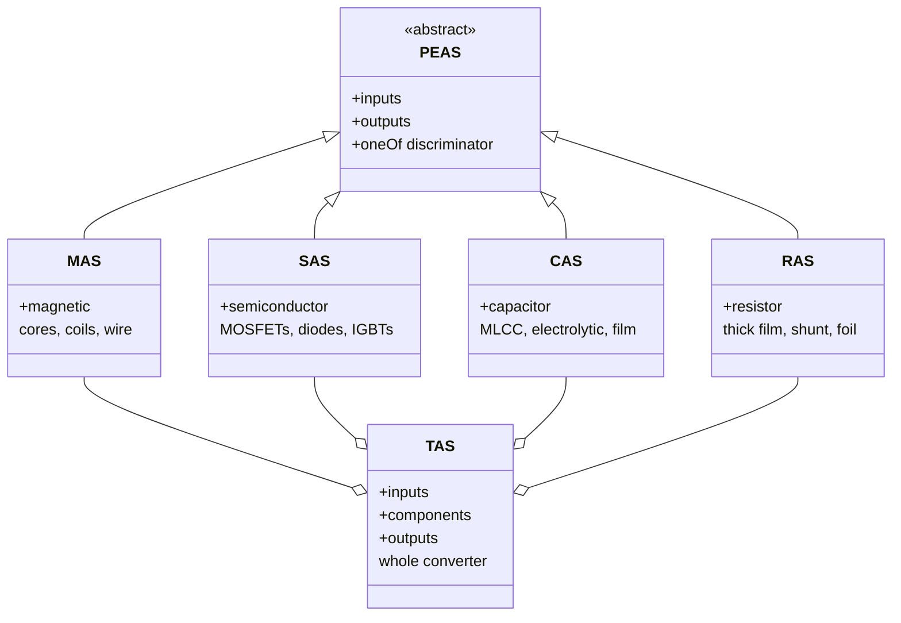
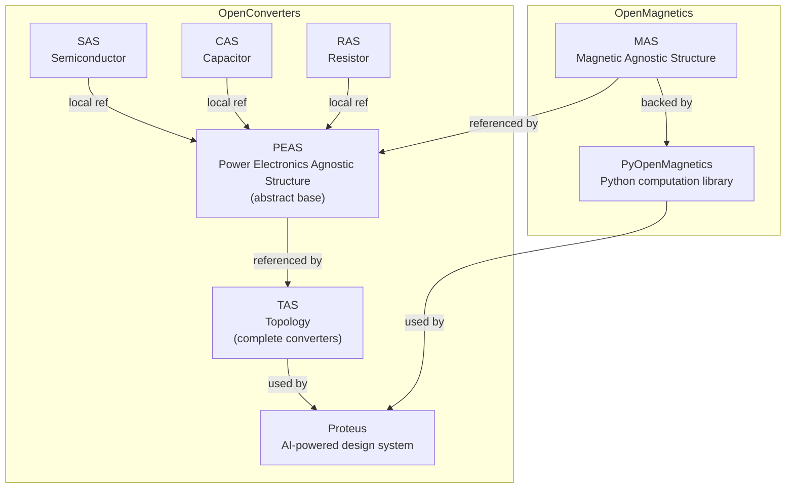
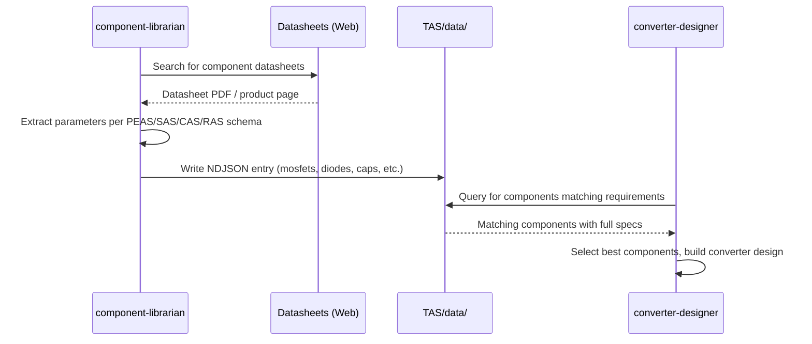
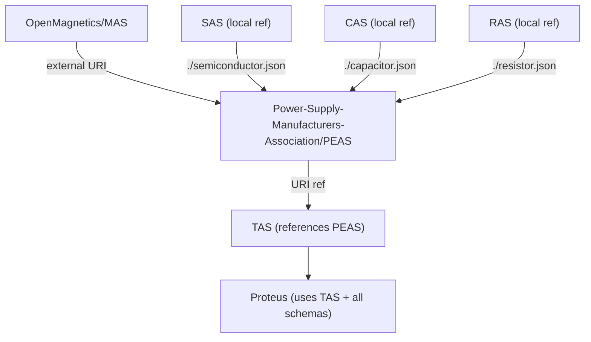

# OpenConverters Ecosystem Architecture

This document describes the full architecture of the OpenConverters component schema ecosystem, how the schemas relate to each other, and how data flows from individual component definitions to complete converter designs.

---

## Overview

The OpenConverters ecosystem defines a family of JSON schemas for describing electronic components and power converter designs. The architecture follows an object-oriented pattern:

- **PEAS** is the abstract base class
- **MAS, SAS, CAS, RAS** are the concrete implementations (one per component family)
- **TAS** is the composite that assembles components into complete designs







---

## Schema Descriptions

### PEAS -- Power Electronics Agnostic Structure

**Repository**: `Power-Supply-Manufacturers-Association/PEAS/`
**Schema**: `schemas/peas.json`
**Role**: Abstract base type for all electronic components

PEAS defines the universal contract:
- Every component has `inputs` (design requirements, operating conditions)
- Every component has `outputs` (computed results)
- Exactly one of four component-type keys must be present: `magnetic`, `semiconductor`, `capacitor`, or `resistor`

The `oneOf` discriminator pattern allows polymorphic references: any code or schema that accepts an PEAS document can handle any component type without knowing which one it is in advance.

**Schema ID**: `http://openconverters.com/schemas/PEAS/peas.json`

---

### MAS -- Magnetic Agnostic Structure

**Repository**: `OpenMagnetics/MAS/`
**Schema**: `schemas/MAS.json`
**Role**: Inductors, transformers, and chokes

MAS is the most mature schema in the ecosystem. It describes:
- **Core**: shape (ETD, PQ, RM, E, toroid, planar), material (N87, 3C95, High Flux, MPP), gapping, stacking
- **Coil**: turns, parallels, wire type (round, litz, foil), insulation layers, bobbin
- **Operating conditions**: frequency, voltage/current waveforms, temperature

MAS includes extensive databases of standard components (500+ core shapes, 50+ ferrite materials, 50+ powder materials, 200+ wire types) and is backed by computation libraries:
- **PyOpenMagnetics** (Python) -- core loss (iGSE), winding loss (Dowell), thermal modeling
- **MKF** (C++) -- high-performance simulation engine

The three-section pattern (`inputs` + `magnetic` + `outputs`) that MAS established became the template for all other component schemas.

**Schema ID**: `http://openmagnetics.com/schemas/MAS.json`
**Component key in PEAS**: `magnetic`

---

### SAS -- Semiconductor Agnostic Structure

**Repository**: `OpenConverters/SAS/`
**Schema**: `schemas/SAS.json`
**Role**: MOSFETs, diodes, IGBTs, BJTs

SAS describes semiconductor devices used in power converters:
- Device identification (part number, technology, package)
- Electrical parameters (voltage ratings, current ratings, on-resistance, threshold voltage)
- Switching characteristics (rise/fall times, gate charge, reverse recovery)
- Thermal parameters (junction-to-case, junction-to-ambient thermal resistance)
- SPICE model parameters

**Schema ID**: `http://openconverters.com/schemas/SAS/SAS.json`
**Component key in PEAS**: `semiconductor`

---

### CAS -- Capacitor Agnostic Structure

**Repository**: `OpenConverters/CAS/`
**Schema**: `schemas/CAS.json`
**Role**: Ceramic, electrolytic, and film capacitors

CAS describes capacitor components:
- Capacitor technology (MLCC, aluminum electrolytic, polymer, film)
- Electrical parameters (capacitance, voltage rating, ESR, ESL, dissipation factor)
- Bias derating (DC bias effect on MLCC capacitance)
- Temperature characteristics (X5R, X7R, C0G, etc.)
- Ripple current ratings and lifetime models

**Schema ID**: `http://openconverters.com/schemas/CAS/CAS.json`
**Component key in PEAS**: `capacitor`

---

### RAS -- Resistor Agnostic Structure

**Repository**: `OpenConverters/RAS/`
**Schema**: `schemas/RAS.json`
**Role**: Thin film, thick film, wirewound, shunt, foil, and other resistors

RAS describes resistor components:
- Technology type (thinFilm, thickFilm, wirewound, carbonComposition, metalOxide, foil, shunt)
- Electrical parameters (resistance, tolerance, TCR, power rating, max voltage)
- SPICE model parameters (r, tcr1, tcr2)
- Power derating curves (temperature vs. allowable power fraction)
- Mechanical dimensions and assembly type

**Schema ID**: `http://openconverters.com/schemas/RAS/RAS.json`
**Component key in PEAS**: `resistor`

---

### TAS -- Topology Agnostic Structure

**Repository**: `OpenConverters/TAS/`
**Schema**: `schemas/TAS.json`
**Role**: Complete power converter designs

TAS is the top-level schema that assembles individual components into a complete converter design:

- **inputs**: Converter-level requirements (input voltage range, output voltage/current, efficiency targets, topology selection, switching frequency)
- **components**: A list of PEAS-typed components with circuit roles and a netlist defining how they connect
- **outputs**: Converter-level results (efficiency, loss breakdown, waveforms, thermal map)

Each component in the `componentList` has:
- `name`: Reference designator (e.g., "T1", "Q1", "C1", "R1")
- `role`: Circuit function (e.g., `mainTransformer`, `highSideSwitch`, `outputCapacitor`, `currentSenseResistor`)
- `data`: Either a full PEAS document inline, or a string path/URI to an external PEAS file

The `netlist` section defines circuit topology by listing nodes and connecting component pins to those nodes.

**Schema ID**: `http://openconverters.com/schemas/TAS/TAS.json`

---

## The Inputs-Component-Outputs Pattern

Every schema in the ecosystem follows the same three-section pattern established by MAS:

```
+-----------+     +-------------+     +-----------+
|  inputs   |  +  |  component  |  =  |  outputs  |
+-----------+     +-------------+     +-----------+
| Operating |     | Physical    |     | Computed  |
| conditions|     | description |     | results   |
+-----------+     +-------------+     +-----------+
```

| Schema | Input Examples | Component Key | Output Examples |
|--------|---------------|---------------|-----------------|
| MAS | Inductance, frequency, waveforms | `magnetic` | Core loss, winding loss, flux density |
| SAS | Voltage, current, switching freq. | `semiconductor` | Conduction loss, switching loss, Tj |
| CAS | Ripple current, DC bias, frequency | `capacitor` | ESR loss, lifetime, effective capacitance |
| RAS | Voltage, current, temperature | `resistor` | Power dissipation, temperature rise |
| TAS | Vin, Vout, Iout, topology | `components` | Efficiency, total losses, waveforms |

This separation enables reuse: the same physical component (e.g., an ETD34 transformer) can be evaluated under different operating conditions by changing only the `inputs` section.

---

## Data Organization

Each component schema repository follows a consistent directory structure:

```
<Schema>/
+-- schemas/          # JSON Schema definitions
+-- data/             # Manufacturing building blocks (series, families, templates)
+-- examples/         # Example documents
+-- docs/             # Documentation
```

### Important: data/ vs. TAS/data/

Component-level `data/` directories contain **manufacturing building blocks** -- parametric families, series definitions, and templates that describe what manufacturers offer. These are the raw materials for component selection.

`TAS/data/` contains **finished converter designs** -- complete assemblies with specific components selected for specific applications. This is where selected, configured components end up as part of a working design.

---

## Reference Pattern (Inline vs. Path)

Throughout the ecosystem, data can be provided in two ways:

### Inline (embedded directly)

```json
{
    "name": "T1",
    "role": "mainTransformer",
    "data": {
        "inputs": { "..." },
        "magnetic": { "..." },
        "outputs": []
    }
}
```

### By Reference (path or URI)

```json
{
    "name": "T1",
    "role": "mainTransformer",
    "data": "components/T1_flyback_transformer.json"
}
```

This pattern originates from MAS, where core shapes and materials can be specified by standard name (e.g., `"ETD 34"`, `"N97"`) or by providing full dimensional/property data inline. TAS extends this pattern to entire component documents.

---

## Cross-Repository Dependencies



- PEAS references MAS via its external URI (`http://openmagnetics.com/schemas/magnetic.json`)
- PEAS references SAS, CAS, and RAS via local relative paths (`./semiconductor.json`, `./capacitor.json`, `./resistor.json`)
- TAS references PEAS via its URI (`http://openconverters.com/schemas/PEAS/peas.json`)
- Proteus (the AI design system) orchestrates the entire ecosystem, using all schemas and computation libraries to produce complete converter designs

---

## Adding a New Component Type

To add a new component type (e.g., a connector or sensor schema):

1. Create a new repository under OpenConverters (e.g., `XAS/`)
2. Define the component schema following the `inputs` + `<type>` + `outputs` pattern
3. Add a new branch to the `oneOf` discriminator in `PEAS/schemas/peas.json`
4. Add corresponding roles in `TAS/schemas/components.json`

The PEAS abstraction means that TAS and all higher-level tools automatically support the new type once PEAS is updated.
